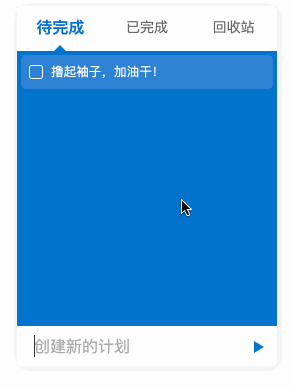

## 在线体验入口

[待办事项清单小工具](https://www.shuaihuajun.com/project/goma-planning/index.html)



## 使用指南

```html
<div id="elePlanning"></div>
```

```js
var planningInstance = new goma.Planning({
  eleWrap: document.querySelector('#elePlanning'),
  navBarColor: '#fff',
  onClickSendTaskBtn: function(inputEl, e){
    console.log(inputEl.value)
  },
  cardsProp: [
    {
      title: '待完成',
      defaultColor: '#666',
      activeColor: '#0074d0',
    },
    {
      title: '已完成',
      defaultColor: '#666',
      activeColor: '#009688',
    },
    {
      title: '回收站',
      defaultColor: '#666',
      activeColor: '#d05047',
    }
  ]
});
```
